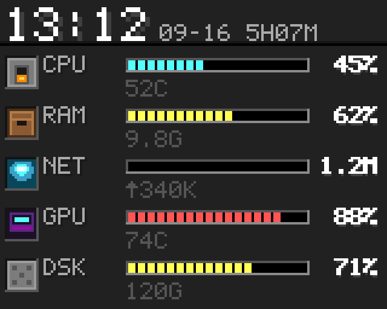
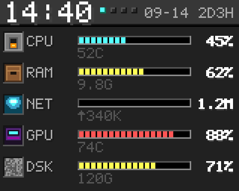

# 桌面电脑状态监控 · PC 小屏

ESP32-WROOM-32 DevKit V1（CH340C）+ ST7735S 128×160 横放（逻辑 160×128）。
PC 端采集本机状态 → USB 串口 1Hz 推 JSON → ESP32 负责显示。

三页：**总览 / 大时钟 / 天气**，单个按键 GPIO13 循环切换；PC 在线时三页每 10 秒自动轮播。

**★ 脱离电脑也能当钟用**：设备自带 2.4G WiFi + SNTP 对时，不接电脑时会自动进时钟页
并显示**正确时间**（不再是一块显示「NO DATA」的砖）。配置见「二 · 6 不接电脑也能用」。
总览页与天气页的数据仍来自 PC。

**状态：固件已编译通过（2026-09-19，931,536 B / Flash 70.6% / RAM 16.3%，0 warning；
已删除日历页、新增三页 10 秒自动轮播、新增 WiFi 独立对时）。**

<p align="center">
  
  
</p>
<p align="center"><sub>
状态页（四环仪表）　｜　翻页时钟
</sub></p>

<p align="center">
  
  
  
</p>
<p align="center"><sub>
总览 · 3x 放大　｜　磁盘方块图标细节　｜　时钟配色备选
</sub></p>

更多设计稿在 `docs/img/`，全部由 `esp32/tools/` 下的生成器离线产出。

---

## 一、接线

| ST7735S | ESP32 | 说明 |
|---|---|---|
| VCC | 3.3V | **不要接 5V** |
| GND | GND | |
| SCL / SCK | GPIO18 | VSPI 时钟 |
| SDA / MOSI | GPIO23 | VSPI 数据 |
| CS | GPIO5 | 片选 |
| DC / A0 | GPIO17 | 数据/命令 |
| RES / RST | GPIO16 | 复位 |
| BLK | GPIO4 | 背光，LEDC PWM 调光（默认 78%） |
| MISO | 不接 | |

按键：**GPIO13 → GND**（内部上拉），短按切页（并重置 10 秒轮播计时），长按 >600ms 切换时钟页数字字体。

接线示意图见 [`docs/接线图.svg`](docs/接线图.svg)（SVG，浏览器可直接打开）。

引脚定义在 `esp32/src/main.cpp` 顶部的 `PIN_*`。

> 避开的引脚：6~11（SPI Flash）、34~39（input-only）、0/2/12/15（strapping）。

---

## 二、跑起来

### 1. 编译烧录

```bat
cd esp32
pio run -t upload
```

首次编译会自动下载 LovyanGFX 与 ArduinoJson（约 130 MB，只需一次）。

**烧录前必须关掉采集脚本**——CH340C 在 DevKit V1 上硬接 UART0，脚本独占 COM 口时
PlatformIO 抢不到端口：

```bat
cd ..\pc
python stop_monitor.py     :: 建 pause.flag + 杀采集进程
```

### 2. 装依赖并启动采集

```bat
pip install psutil pyserial nvidia-ml-py
cd pc
python monitor.py --list        :: 看串口号
python monitor.py               :: 自动扫 CH340
python monitor.py --port COM6   :: 手动指定
python monitor.py --dry-run     :: 只打印 JSON 不下发，调试用
```

### 3. 开机自启 + USB 看门狗

**插上 USB 就自己跑，不用管时机。** 靠两级配合：

| 层 | 是什么 | 干什么 |
|---|---|---|
| 任务计划 `PCMonitorWatch` | 登录时启动 `watcher.py` | 只负责让看门狗活着 |
| USB 看门狗 `watcher.py` | 常驻，每 3 秒扫一次串口 | 看到 CH340 就把 `monitor.py` 拉起来 |

**为什么不直接让任务计划启动 `monitor.py`**：登录瞬间 USB 常常还没枚举完，
那个时点启动是赌运气。看门狗不看时机看硬件——开机时已经插着、还是后来才插、
拔了再插，它都能接管。

任务计划参数：触发器 `AtLogOn`、错过补跑 `StartWhenAvailable`、
失败重启最多 3 次（间隔 1 分钟）、运行时限无限制、全程无窗口。

**为什么用任务计划而不是注册表 Run 键**：Run 键只能"到点跑一次"，跑了就死了没人管；
任务计划能错过补跑、失败重启，而且进程由 `svchost` 托管，更稳。

实测三条行为（都验过）：

- 采集进程被杀 → 3 秒内看门狗自动拉起，屏 5 秒内恢复
- 拔掉开发板 → 看门狗不动作，`monitor.py` 自己等 USB 回来重连（避免抖动误杀）
- 有 `pause.flag` → 看门狗让路不拉起（烧录用）

其他关键点：

- **用 `pythonw` 而不是 `python`**：GUI 子系统程序，天生没有控制台窗口。
  代价是 `pythonw` 没有 stdout，脚本已内置兜底，把输出写进 `pc/monitor.log`。
- **不要包一层 `cmd.exe /c`**：cmd 是控制台程序，登录时会闪一下黑窗口。
- **不要加 VBS / `wscript` 中间层**：本机安全策略把 `wscript.exe` 当 LOLBin 拦截。
- **脚本自带单实例保护**：已有实例在跑时新启动的直接退出，不会多实例抢同一个串口。
- **判断采集在不在跑用端口锁（47651），不扫进程**——扫进程在 pythonw 下
  会把启动中的自己误判成目标，之前踩过。看门狗自己的锁是 47652。
- 采集起来后屏会在 1 秒内从 `PC MONITOR` 跳到数据界面。

安装 / 卸载（**换电脑、重装系统后跑一次就行**）：

```bat
install.bat                    :: 双击。自动找 Python、装依赖、注册任务、启动
python install.py --check      :: 只体检，不改任何东西
python install.py --uninstall  :: 卸载计划任务
```

`install.py` 会做四件事：找解释器（优先无窗口的 `pythonw`）→ 补依赖
（`psutil` / `pyserial`，缺就自动 `pip install`，装不上会退回 `--user`）
→ 注册计划任务 → 启动并回报任务状态。

**路径全是动态探测的**，没有写死用户名和盘符，拷贝整目录到任何一台 Windows
都能用。看门狗拉起采集脚本时也用自己所在的解释器，不会去找某个固定路径。

日常启停：

```bat
python stop_monitor.py     :: 停止采集（烧录固件前必做）
start_monitor.bat          :: 双击，恢复推送
```

**烧录固件的标准流程**（顺序不能反）：

```bat
python stop_monitor.py     :: 创建 pause.flag + 杀采集进程
pio run -t upload          :: 烧录（此刻 COM 口是空的）
start_monitor.bat          :: 删掉 pause.flag，看门狗几秒内自动恢复推送
```

`stop_monitor.py` 必须先建 `pause.flag` 再杀进程——只杀进程的话，
看门狗 3 秒内就把脚本拉回来，COM 口又被抢走，烧录必然失败。

> 脚本版和便携版**任选一种，别同时装**。便携版的日志在
> `pc\dist\pc-monitor-portable\` 下，不在 `pc\` 下——排查时别翻错目录。

### 4. 换到另一台电脑

ESP32 固件在板上，**不用重烧**。要搬的只有 PC 端。按那台电脑有没有 Python 分两条路。

#### 4A. 没装 Python（推荐，零依赖）—— 用免安装便携版

```bat
:: 1. 把 pc\dist\pc-monitor-portable 整个文件夹拷过去（U 盘都行，约 16 MB）
:: 2. 双击「安装.bat」
:: 3. 插上 ESP32，几秒内屏幕离开 PC MONITOR
```

> `pc/dist/` 不入库（见 `.gitignore`），先用 `build_portable.py` 在本机打一次包。

目录里就这些东西（详细看里面的 `使用说明.txt`）：

| 文件 | 作用 |
|---|---|
| `monitor.exe` | 采集端，每 1 秒把状态推给小屏 |
| `watcher.exe` | 看门狗，每 3 秒扫串口，见到 CH340 就拉起采集端 |
| `安装.bat` / `卸载.bat` | 注册 / 删除计划任务 |
| `暂停采集.bat` / `恢复采集.bat` | 烧录固件前暂停，烧完恢复 |
| `watcher.log` / `monitor.log` | 出问题时先看这两个 |

重新打包（改过脚本之后必须重打，否则 exe 里还是旧逻辑）：

```bat
python build_portable.py     :: 需要 PyInstaller：pip install pyinstaller
```

#### 4B. 装了 Python 3.8+（勾了 Add Python to PATH）—— 用脚本版

```bat
:: 1. 把整个 pc 目录拷过去
:: 2. 双击 install.bat
::    它会自动：找 Python -> 装 psutil/pyserial -> 注册计划任务 -> 启动看门狗
:: 3. 插上 ESP32，几秒内屏幕离开 PC MONITOR
python install.py --check    :: 想先体检就跑这个，不改任何东西
```

两条路共用的几个已处理掉的坑：

- **路径不写死**：原来硬编码了某台机器的 PlatformIO 解释器绝对路径，
  换台机器必然失效。现在脚本版运行时探测解释器，打包版用 exe 自身位置定位。
- **串口号不写死**：自动扫 CH340（VID `1A86`），换台电脑分到 COM3 还是 COM9 都能连。
- **两台电脑别同时插**：板子只有一个串口，两台都跑采集会互相抢。

打包这件事有几个坑，都处理了，重新打包时别改回去：

- **必须用 `--windowed`**：常驻程序不能有控制台窗口，否则桌面一直挂黑框。
  windowed 模式下 `sys.stdout` 为 None，脚本已兜底把输出写进日志文件。
- **日志路径不能用 `__file__`**：打包成单文件 exe 后 `__file__` 指向临时解压目录
  （`_MEIPASS`），日志会写进去然后随进程退出丢失。两个脚本统一用 `app_dir()`——
  frozen 时取 `sys.executable` 所在目录，保证日志落在 exe 旁边。
- **看门狗要直接拉 `monitor.exe`**：打包后没有解释器可调用，`watcher.py` 里
  按 `sys.frozen` 判断，frozen 时执行同目录的 `monitor.exe`。
- **中间产物放纯 ASCII 目录**：`build_portable.py` 把 work/spec 丢到 `%TEMP%`，
  打完再拷回来——中文路径下 PyInstaller 容易出幺蛾子。
- **进程列表里一个实例显示两个 PID**：PyInstaller 单文件模式是「bootloader 父进程
  + 真子进程」，不是双开。脚本版同理（venv 包装器 + 真解释器）。
- **必须用带 PyInstaller 的那个解释器跑**：`build_portable.py` 开头会自检，
  没装 PyInstaller 会直接退出并提示。

### 5. 屏停在 PC MONITOR 怎么排查

`PC MONITOR` 是**等待态**，只说明一件事：ESP32 没收到串口数据。跟屏幕几何、
固件渲染都没关系，别去动 `OFFSET_X/Y`。

按顺序查：

1. **看门狗活着吗** —— 任务 `PCMonitorWatch` 的 `State` 应该是 `Running`，
   用 `schtasks /query /tn PCMonitorWatch` 查；不是就重跑 `install.bat`。
2. **看 `pc/watcher.log`** —— 每 3 秒扫一次，状态变化才记一行：
   - `CH340=未连接` → 线没插好或驱动没装，先看设备管理器。
   - `CH340=COM6 暂停=否 采集=未运行` 却没跟着出现「拉起采集脚本」→ 看门狗卡了，重启任务。
   - `暂停=是` → 有 `pause.flag` 忘了删（烧录后没跑 `start_monitor.bat`）。
3. **看 `pc/monitor.log` 最后几行**：
   - 没有 `[LAUNCH]` 痕迹 → 采集没被拉起，看上一条。
   - 有 `[LAUNCH]` 但没 `[串口] 已连接` → 卡在等 CH340，检查 USB 线和驱动。
   - 有 `[崩溃]` → 下面就是 traceback，照着修。
4. **COM 口被别的程序占了** —— 串口监视器、Arduino IDE 串口绘图仪、`handle64.exe -a Serial` 都能看出来。
5. 烧录固件前必须 `python stop_monitor.py`，否则 PlatformIO 抢不到 COM 口。

### 6. 不接电脑也能用（WiFi 独立对时）

设备插充电头独立供电时，会自动进时钟页并联网取标准时间 —— 不再是「NO DATA」砖。

**首次配置**（只需一次；凭据写进设备 NVS，**不随固件、不进仓库**）：

```
python pc/stop_monitor.py                 # 先让出串口
（用任意串口工具连 COM7 @115200，逐行发送：）
WIFI:你的SSID,你的密码                     # 可发两组（主 / 备用路由器）
NET?                                      # 查看当前状态
```

写完直接拔线插充电头即可。上电 3 秒后开始尝试连接，**拿到时间立刻关掉 WiFi**。

**注意**

- ESP32-WROOM-32 **只支持 2.4G**，路由器的 5G 名字连不上（双频合一通常没问题）。
- 凭据存 NVS，**源码里没有任何 WiFi 密码** —— 这是为 `export_opensource.py` 导出时不泄露。
- 最多记住 2 组，按顺序尝试；换路由器重发 `WIFI:` 即可覆盖；`WIFICLR` 清空全部。
- 没有网络时可用串口手动对时：`TIME:2026-09-19 13:40:00`（重启即失效，仅作兜底）。
- 屏上状态词（时钟页卡片下方）：`NO CFG` 未配置 / `LINKING` 连接中 / `SYNCING` 对时中 /
  `WIFI OK` 已对时 / `NO NET` 连不上 / `NO TIME` 有凭据但还没对上。
- 串口心跳可直接看到设备自己的时间：`[HB] view=1 rx=.. net=WIFI OK t=13:52:03 heap=..`。

---

## 三、屏幕不对，改这几个常量

都在 `esp32/src/main.cpp` 顶部，别的地方不要动。

| 现象 | 改哪个 |
|---|---|
| 有白边 / 画面偏移 | `OFFSET_X`（现 0）、`OFFSET_Y`（现 0） |
| **整屏画面倾斜** | panel 配置里的 `cfg.memory_width`，现 **130**（用库默认 132 就会斜） |
| 红蓝颜色反了 | `RGB_ORDER` → `true` |
| 整屏发黑或发白 | `INVERT_COL` → `true` |
| 花屏 | `SPI_FREQ` 从 `20000000` 降到 `10000000` |
| 屏幕装反了（外壳倒装） | `PANEL_FLIP_180` → `1`（软件逐像素翻转 180°，见下节） |

`cfg.memory_width` 不在顶部常量区，它在 `LGFX` 构造函数的 `_panel.config(cfg)` 块里，
搜 `CFG5` 注释就能找到（那组几何参数是实测轮播挑出来的，别改回默认）。

改完重新 `pio run -t upload`。

### 关于 `PANEL_FLIP_180`（屏幕倒装）

外壳如果把它装反了，把 `PANEL_FLIP_180` 改成 `1` 即可，**别处不用动**。
实现是每帧画完后把整块精灵缓冲做一次逐像素 180° 翻转（行序倒置 + 行内像素倒置），
只搬 16bit 元素、不拆字节，所以 `swap565` 语义不变、不需要额外换字节序。

**为什么不直接用 `setRotation(3)`**：这块 ST7735S 的非标准几何（GRAM 132×162 /
可视 128×160）在 rotation 1 与 rotation 3 下的地址窗口无法对齐，实测两组参数都失败
（先是对角线错位，再是顶部一条乱码）。像素级翻转不触碰地址窗口与 MADCTL，
原理上不会出现错位。

翻转后**逻辑坐标与屏幕视觉是反的**，两件事必须记住：

- 逻辑 y 小 → 物理 y 大 → **屏幕视觉的下方**。屏幕最下方同时是 SPI 写入起点与
  面板扫描起点，两者同向同速，1Hz 整屏刷新时这一带撕裂最重。
- 所以：**每秒变化的高对比内容（时钟、日期）绝不能放在逻辑顶边**。
  两端各留一条静态纯背景带（`EDGE_TOP` / `EDGE_BOT`）就是为了这个——
  端点行每帧恒定，撕裂发生在端点也看不见。
- 幕布过渡要画在**逻辑右侧**，屏上才出现在左侧。

别试图用"每帧把端点行涂成背景色/复制邻行"来补——试过两版都反而露出横线或
把图标底行搬进撕裂带。**结构上留出静态带是唯一可靠的解法。**

---

## 四、显示内容

三页，**单个按键 GPIO13** 循环切换，或 **PC 在线时每 10 秒自动轮播**（切后在本页停留 10 秒，三页循环）。170ms 幕布过渡、1s 刷新、静态不闪烁。

> 自动轮播只在 **PC 在线**时生效。PC 关机 / 断流超过 5 秒后停在时钟页当钟用，不再轮播
> —— 否则会轮流停在总览 / 天气页显示「未连接」。手动短按切页会把 10 秒计时清零重算。

| 页 | 内容 |
|---|---|
| 0 OVERVIEW | 四环仪表：CPU / RAM / NET / GPU 四环 + 顶部时钟 + 右侧日期（蓝=正常，≥80% 整环转红） |
| 1 CLOCK | 彩虹电子时钟：六位糖果色数字 + 日期 + 开机时长；PC 断流 5s 后离线自走时 |
| 2 WEATHER | 城市 + 彩虹环温（弧长=当日高低温区间位置）+ 环内糖果温度 + 高低温 / 湿度 / 风速 |

> 原「整面月视图」日历页已于 2026-09-19 删除（页面数 4 → 3）。

顶栏：时间 + 日期 + 开机时长 + 页码方块。断流 5 秒后日期区显示 `OFF`。

### 1 · 总览页（《我的世界》主题）

色值与结构取自 MC 的 GUI 设计语言：16 色格式化调色板、GUI 灰阶、经验条绿 `#80FF20`。
三条结构规则比色值更关键——**立体边框**（凸=上/左亮、下/右暗；凹反过来）、
**文字右下 1px 投影**、**方块图标嵌物品栏凹槽**。

| 行 | 方块图标 | 条色 | 主值 | 副值 |
|---|---|---|---|---|
| CPU | 熔炉（石框 + 橙火） | §b 青 | 占用 % | 温度 |
| RAM | 箱子（棕木 + 锁扣） | §6 金 | 占用 % | 已用 GB |
| NET | 信标（青宝石） | §9 蓝 | ↓下行速率 | ↑上行速率 |
| GPU | 附魔台（紫 + 符文） | §d 品红 | 占用 % | 温度 |
| DSK | 石头（石块纹理） | §a 绿 | 占用 % | 剩余 GB |

字体是 **5×7 点阵（44 字形）**，本页内容全 ASCII，**不需要中文字库**——
比下面那几套汉字字模轻得多。数据链路：

```
tools/mc_ui_preview.py   设计稿生成器（零第三方依赖，出 1x / 3x / 局部放大 / 字形表 PNG）
        │  import
        ▼
tools/gen_mc_theme.py    导出 src/mc_theme.h（PROGMEM 位图 + 绘制函数），
        │                自带「写出的 C 文本重新解析回来逐值比对」校验
        ▼
   src/mc_theme.h        5×7 字形 / 12×12 方块图标 / mcStr / mcBevel / mcXpBar
```

改设计稿后重跑 `gen_mc_theme.py` 即可（`python gen_mc_theme.py`，日志落 `gen_mc_theme.log`），
**不要手改 `mc_theme.h`**，否则下次生成会覆盖。

排版验证另有一个只读工具 `tools/st_layout_preview.py`：用与固件相同的常量
（`EDGE_TOP` / `BODY_TOP` / `ROW_H`）重画一遍状态页，改版式前先看它，4x 放大出图。

### 2 · 中文点阵字库（天气页用）

内置字体无中文，三套互相隔离的 PROGMEM 字模（都是 SimHei 16×16 生成，
**仓库只含生成出的位图数组，不含字体文件**，见 `THIRD_PARTY.md`）：

| 文件 | 字数 | 生成脚本 | 用途 |
|---|---|---|---|
| `src/cn_font.h` | 12 | `tools/gen_cnfont.py` | **已停用**（原日历标题 年 / 月 / 一~十）；文件保留备用 |
| `src/weather_cn.h` | 34 | `tools/gen_weather_cn.py` | 天气词（晴 / 阴 / 雨 / 高 / 低 / 湿…） |
| `src/cn_city.h` | 199 | `tools/gen_city_cn.py` | 城市地名（省会 + 主要地级市 + 汉江/秦巴一带） |

排版铁律：双字标签占 2×(16+2)=36px，必须用 `cnStrW()` **真测宽**推进——
按单字宽 18px 推会让数字压在字上。字库缺字时 `wcnFind` 返 -1，整段不渲染。

**CPU 温度默认 `--`**：Windows 上没有管理员权限读不到，代价不值。
想开的话：`python monitor.py --temp`，需要管理员 + 把 `LibreHardwareMonitorLib.dll`
放到脚本同目录。

**GPU 非 N 卡显示 `--`**：A 卡和 Intel 核显在 Windows 上没有干净的读取接口。

### 3 · 时钟页（含离线走时）

HH MM SS 六张卡片式数字，每位数从 Candy Rainbow 调色板依次取色，
翻页动画由 `gStretch` 控制拉伸程度。

数字不是内置字体，而是 **4-bit alpha 掩码**（0..15 覆盖度），由
`tools/gen_clock_font.py` 用「超采样 SS=4 渲染 → 形态学膨胀加粗 → LANCZOS 降采样
→ 4bit 量化」烘焙而来——加粗做在超采样大图上，所以加粗后边缘仍然抗锯齿。
内置 4 套字体，**长按按键 >600ms 现场切换**。改字体或粗细后重跑生成器，
它自带触边自检（数字左右必须各留 ≥1px，否则报 `⚠`）。

**离线走时 + 自动对时**：PC 关机 / 断流超过 5 秒，设备自动跳到时钟页当钟用。
时间来源按优先级三级（配置见「二 · 6 不接电脑也能用」）：

1. **PC 在线** —— 串口每帧带真实时间，逐帧对齐，零漂移；
2. **PC 不在线** —— 设备自己连 2.4G WiFi 走 SNTP 取一次标准时间，之后由内部时钟自走，
   每 6 小时重校一次（**拿到时间立刻关 WiFi**，不干扰 SPI 刷屏、也不费电）；
3. **取不到时间** —— 继续用内部时钟，屏上给出状态词（`NO NET` / `NO CFG`）。

内部走时取决于 ESP32 的 40MHz 晶振（±10~40ppm），一天偏差数秒内，看时间够用。
**从来没有时间源**时（刚上电且未联网），时钟页显示六张空卡片 + 横杠占位 + 状态词，
不会退化成一块「NO DATA」。

### 4 · 天气页

`pc/monitor.py` 在 PC 侧拉天气，把结果随状态一起推进固件 —— 天气数据始终由 PC 提供。
（ESP32 自身只在「没有 PC 时间源」时短暂联网做 NTP 对时，不负责抓天气。）

配置在 `pc/weather_tune.json`（仓库给的是 `weather_tune.example.json`，
复制改名即可），可写死城市，也可以 `auto_location` 走 IP 定位。

几个已经踩过的坑，改这块前先读：

- **中文城市名与坐标必须同源。** 先用国内源（pconline）拿到中文城市名，
  再用 Open-Meteo 的 geocode 取该城市的坐标；`ipinfo.io` 只做兜底，
  且它的英文名必须能被内置 `CITY_ZH` 表识别才采纳其坐标。
  早期把「ipinfo 的坐标 + pconline 的中文名」拼在一起，屏上显示出「安康」
  而温度是另一个城市的——地名和天气对不上，就是这么来的。
- **网络出口直连优先。** 如果系统装了代理软件但没启动，
  Windows 下 `urllib.getproxies()` 会读到注册表里的代理地址，
  把所有请求发往一个没人监听的端口，四个天气源会全挂。
  `monitor.py` 里 `_open()` 显式用 `ProxyHandler({})` 先直连、失败才回落代理，
  日志会打一行 `[天气] 网络出口：直连`。
- **结果落盘缓存** `weather_cache.json`：看门狗重启 monitor 时先用缓存顶住，
  断网也不至于显示「无数据」。
- **失败退避重试** 30s→60s→…→300s，开机时网络往往还没就绪，这一步很关键。
- **城市名回退字段必须是纯 ASCII**：设备端中文缺字时用 ASCII 字库渲染它，
  所以 `monitor.py` 会用 `CITY_EN` 把中文城市名转成拼音（安康 → ANKANG）。

---

## 五、仓库结构

```
esp32/
  platformio.ini          工程配置（依赖走 lib_deps 自动下载）
  no_map.py               摘掉 -Wl,-Map，绕开中文路径导致链接失败（见第七节）
  src/
    main.cpp              固件全部逻辑（三页渲染 / 按键 / 串口协议 / 翻转）
    mc_theme.h            总览页点阵字与方块图标（生成物，勿手改）
    clock_fonts.h         时钟页 4-bit alpha 数字掩码（生成物，勿手改）
    cn_font.h             中文点阵字模（已停用，保留备用）
    weather_cn.h          中文点阵字模 —— 天气词
    cn_city.h             中文点阵字模 —— 城市名
    netclock.h/.cpp       独立对时：WiFi + SNTP，凭据存 NVS（不接电脑也能当钟用）
  tools/                  离线工具（生成器 / 仿真 / 硬件探针）
    gen_mc_theme.py       总览页主题 → mc_theme.h
    gen_clock_font.py     时钟数字掩码 → clock_fonts.h
    gen_cnfont.py         字模生成器 → cn_font.h（当前未参与编译）
    gen_weather_cn.py     天气词字模 → weather_cn.h
    gen_city_cn.py        城市名字模 → cn_city.h
    mc_ui_preview.py      总览页设计稿（gen_mc_theme.py 的数据源）
    st_layout_preview.py  状态页排版验证（4x 出图）
    probe_diag.py         硬复位 + 注帧 + 读心跳，区分「没收到」与「解析失败」
    _verify_rotation.py   运行期验证三页 10 秒自动轮播（注帧保活 + 记录 [HB] view 序列）
    _sim_netclock.py      对时状态机 PC 端仿真（超时/退避/重校窗口，27 条断言）
    _verify_offline_clock.py  运行期验证「脱离电脑自己取到时间」（停 monitor + 硬复位 + 采样）
    _diag_flash_fail.py   烧录失败排查（端口占用 / 目录完整性 / flash.exe 完整输出）
    probe_boot.py / probe_frame.py / read_glyph_debug.py
  tools/fonts/            时钟页用的 OFL 字体（Trebuchet MS 不在其中）
pc/
  monitor.py              PC 端采集，1Hz 推 JSON
  watcher.py              USB 看门狗
  install.py / install.bat          安装与卸载计划任务
  stop_monitor.py / start_monitor.bat
  build_portable.py       打包免安装便携版（需要 PyInstaller）
  flash.py                串口烧录辅助
  test_pipeline.py        端到端自检
  weather_tune.example.json         天气配置模板
docs/
  接线图.svg
  img/                    精选设计稿（生成器产出的原图在 esp32/tools/，不入库）
licenses/                 随仓库分发的字体许可全文（OFL 1.1）
```

---

## 六、依赖与许可

本项目代码以 **MIT** 发布，见 `LICENSE`。
第三方组件（LovyanGFX FreeBSD / ArduinoJson MIT / 三套 OFL 字体 / 不收录的商业字体 /
《我的世界》风格声明）逐项列在 **`THIRD_PARTY.md`**，上手前建议扫一眼。

一句话总结：**仓库不含任何第三方库源码、不含商业字体、不含打包产物**，
`pio run` 会自动补齐依赖，字体许可全文在 `licenses/`。

---

## 七、开发环境备注

### 1. 中文路径的坑（已绕过）

工程目录如果含中文，xtensa 链接器无法在非 ASCII 路径创建 `firmware.map`，链接会失败。
`esp32/no_map.py` 摘掉了 `-Wl,-Map` 参数来解决。

**根治**：把项目搬到纯 ASCII 路径（比如 `F:\pc-monitor`），
然后删掉 `platformio.ini` 里的 `extra_scripts = no_map.py` 和 `no_map.py` 本身。

### 2. 为什么锁 `espressif32@6.12.0`

不锁版本时平台每次都会联网查 registry，网差时卡住。锁定后行为可复现。
换平台版本要注意：`tool-scons` 需要 **4.41101.0**（`6.12.0` 的要求），
低版本的 ESP8266 老项目可能得把目录名换回去。

### 3. 改完代码记得重新生成

`mc_theme.h` / `clock_fonts.h` / 三套中文字模都是**生成物**。
改了 `tools/` 下的设计稿或字表，要重跑对应生成器再编译——
手改这些 `.h` 会在下次生成时被覆盖。
